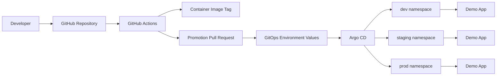
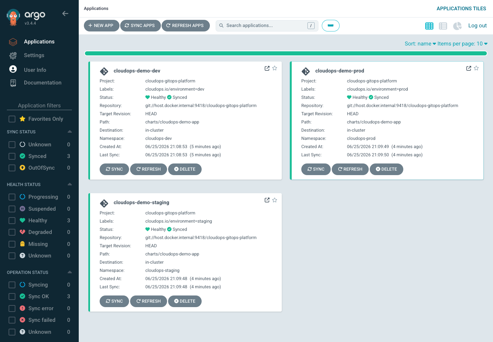
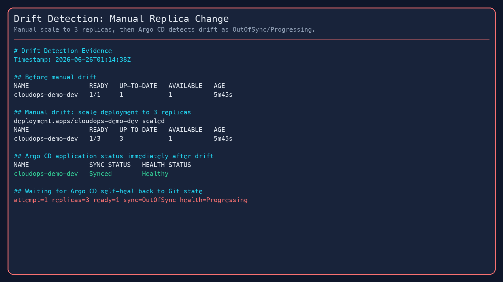
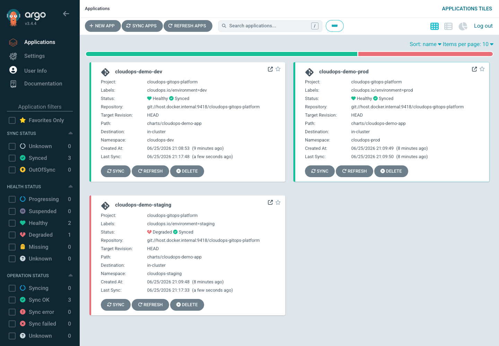

# CloudOps GitOps Platform

CloudOps GitOps Platform is a Kubernetes delivery platform that demonstrates Git-based environment promotion, Argo CD sync control, namespace-isolated environments, drift correction, rollback recovery, and an AWS EKS/ECR deployment path.

This project is intentionally different from an application deployment project. The app is small on purpose. The platform behavior is the point: Git defines desired state, Argo CD reconciles the cluster to that state, and environment changes move through reviewable Git updates.

## What This Demonstrates

- GitOps delivery with Argo CD as the reconciliation controller
- Namespace-isolated `dev`, `staging`, and `prod` environments
- Resource quotas and scoped RBAC boundaries per environment
- Helm-based application packaging with environment-specific values
- Argo CD multi-source Applications so environment values stay outside the chart without path traversal
- PR-style promotion workflow from `dev` to `staging` to `prod`
- Drift detection and self-healing after manual cluster changes
- Failed deployment recovery through Git rollback
- Terraform-provisioned AWS foundation for EKS, ECR, IAM, and VPC networking

## Architecture



More detail: [docs/architecture.md](docs/architecture.md)

## Deployment Model

The repository supports two deployment targets:

- EKS deployment using the default `environments/{dev,staging,prod}` values, which point at ECR images.
- Local validation using `VALUES_ROOT=environments/local`, which points at kind/minikube-loaded images.

The local validation path checks the GitOps mechanics using `kind` or `minikube`:

1. Install Argo CD.
2. Apply namespaces, ResourceQuotas, and RBAC.
3. Sync three Argo CD Applications.
4. Promote app versions through Git changes.
5. Demonstrate drift correction and rollback recovery.

The Terraform directory defines and provisions the AWS foundation for the EKS deployment. The applied model uses one EKS cluster and keeps `dev`, `staging`, and `prod` isolated as Kubernetes namespaces.

AWS deployment path and permission preflight: [docs/aws-deployment.md](docs/aws-deployment.md)

## Repository Structure

```text
.
├── app/                         # Small app used to validate delivery behavior
├── charts/cloudops-demo-app/    # Helm chart for the app
├── environments/                # Environment-specific Helm values
├── platform/                    # Namespaces, ResourceQuotas, and RBAC
├── argocd/                      # AppProject and Application manifests
├── terraform/                   # AWS VPC, EKS, ECR, and IAM infrastructure
├── docs/                        # Architecture, validation records, runbooks, tradeoffs
├── scripts/                     # Local bootstrap and validation helpers
└── .github/workflows/           # CI and PR-style promotion workflows
```

## Validation Evidence

Validation artifacts are captured under [docs/screenshots](docs/screenshots).

- Argo CD showing `cloudops-demo-dev`, `cloudops-demo-staging`, and `cloudops-demo-prod` as Synced and Healthy
- Manual replica drift detected as OutOfSync and reconciled back to Git state
- Bad image or broken readiness probe producing a Degraded application
- Git rollback restoring the last healthy version
- Environment quotas and RBAC visible in Kubernetes
- Argo CD Applications resolving `$values/environments/.../values.yaml` successfully

Screenshot evidence is documented in [docs/screenshots/README.md](docs/screenshots/README.md).

Detailed validation results: [docs/local-validation-results.md](docs/local-validation-results.md)

AWS validation results: [docs/aws-validation-results.md](docs/aws-validation-results.md)

Engineering notes and boundaries: [docs/engineering-notes.md](docs/engineering-notes.md)

## Screenshot Gallery








## Promotion Model

Promotion is PR-style: a workflow opens a pull request that updates the target environment's Helm values with an already-built image tag. `dev` receives new versions first, then the same tag is promoted to `staging`, then `prod`.

Details: [docs/promotion-workflow.md](docs/promotion-workflow.md)

## Boundary

Implemented environment model:

> GitOps delivery with namespace-isolated dev/staging/prod environments using Argo CD Applications, Helm values, ResourceQuotas, scoped RBAC, and Git-based promotion.

The scoped RBAC manifests model environment access boundaries for manual/operator or CI-style namespace actions. Argo CD still syncs through its controller permissions.

This repository does not implement separate AWS accounts, separate EKS clusters, fully isolated cloud environments, or Argo CD per-environment sync impersonation.

## Commands

Render all Helm manifests locally:

```bash
./scripts/render-helm.sh
```

Validate local files:

```bash
make validate
```

Build and load local kind images:

```bash
./scripts/build-load-local-images.sh
```

Bootstrap a local cluster after creating one with `kind` or `minikube`:

```bash
./scripts/install-argocd.sh
VALUES_ROOT=environments/local ./scripts/local-bootstrap.sh
```

First live Argo CD test:

```bash
git init
git add .
git commit -m "Initial CloudOps GitOps Platform"
./scripts/local-git-server.sh
GIT_REPO_URL=git://host.docker.internal:9418/cloudops-gitops-platform PROJECT_ONLY=true ./scripts/local-bootstrap.sh
GIT_REPO_URL=git://host.docker.internal:9418/cloudops-gitops-platform VALUES_ROOT=environments/local APP_ENV=dev ./scripts/local-bootstrap.sh
argocd app get cloudops-demo-dev
```

Detailed checklist: [docs/first-argocd-sync-test.md](docs/first-argocd-sync-test.md)

Run validation scenarios:

```bash
./scripts/demo-drift.sh dev
./scripts/demo-rollback.sh staging
```

## AWS Deployment Evidence

AWS deployment completed for the validation environment:

- Terraform applied the dev AWS root for VPC, EKS, ECR, and IAM
- App images were pushed to Amazon ECR with `0.1.0-dev`, `0.1.0-staging`, and `0.1.0-prod` tags
- Argo CD on EKS synced from the public GitHub repository
- Drift and rollback scenarios were re-run on EKS
- Final Argo CD, Kubernetes, ECR, and AWS evidence screenshots were captured
