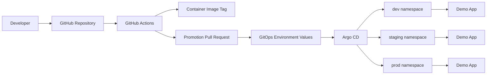

# CloudOps GitOps Platform

CloudOps GitOps Platform is a production-style Kubernetes delivery platform that demonstrates Git-based environment promotion, Argo CD sync control, namespace-isolated environments, drift correction, and rollback recovery.

This project is intentionally different from an application deployment project. The app is small on purpose. The platform behavior is the point: Git defines desired state, Argo CD reconciles the cluster to that state, and environment changes move through reviewable Git updates.

## What This Demonstrates

- GitOps delivery with Argo CD as the reconciliation controller
- Namespace-isolated `dev`, `staging`, and `prod` environments
- Resource quotas and scoped RBAC boundaries per environment
- Helm-based application packaging with environment-specific values
- Argo CD multi-source Applications so environment values stay outside the chart without path traversal
- PR-style promotion workflow from `dev` to `staging` to `prod`
- Drift detection and self-healing after manual cluster changes
- Failed deployment recovery through Git rollback
- EKS-ready Terraform scaffold for the later AWS implementation phase

## Architecture



More detail: [docs/architecture.md](docs/architecture.md)

## Local-First Scope

The weekend build proves the GitOps mechanics locally using `kind` or `minikube`:

1. Install Argo CD.
2. Apply namespaces, ResourceQuotas, and RBAC.
3. Sync three Argo CD Applications.
4. Promote app versions through Git changes.
5. Demonstrate drift correction and rollback recovery.

The Terraform directory is a phase-2 AWS scaffold. It defines the intended VPC, EKS, ECR, and IAM module boundaries without turning this local GitOps proof into an AWS provisioning exercise.

## Repository Structure

```text
.
├── app/                         # Small demo app used to prove delivery behavior
├── charts/cloudops-demo-app/    # Helm chart for the app
├── environments/                # Environment-specific Helm values
├── platform/                    # Namespaces, ResourceQuotas, and RBAC
├── argocd/                      # AppProject and Application manifests
├── terraform/                   # Phase-2 AWS scaffold
├── docs/                        # Architecture, demos, evidence, tradeoffs
├── scripts/                     # Local bootstrap and demo helpers
└── .github/workflows/           # CI and PR-style promotion workflows
```

## Demo Evidence Targets

The project is considered locally complete when these artifacts can be captured:

- Argo CD showing `cloudops-demo-dev`, `cloudops-demo-staging`, and `cloudops-demo-prod` as Synced and Healthy
- Manual replica drift detected as OutOfSync and reconciled back to Git state
- Bad image or broken readiness probe producing a Degraded application
- Git rollback restoring the last healthy version
- Environment quotas and RBAC visible in Kubernetes
- Argo CD Applications resolving `$values/environments/.../values.yaml` successfully

Screenshot placeholders live in [docs/screenshots/README.md](docs/screenshots/README.md).

## Promotion Model

Promotion is PR-style: a workflow opens a pull request that updates the target environment's Helm values with an already-built image tag. `dev` receives new versions first, then the same tag is promoted to `staging`, then `prod`.

Details: [docs/promotion-workflow.md](docs/promotion-workflow.md)

## Production Claim Boundary

Accurate claim for the local build:

> Built a GitOps delivery workflow with namespace-isolated dev/staging/prod environments using Argo CD Applications, Helm values, ResourceQuotas, scoped RBAC, and Git-based promotion.

The scoped RBAC manifests model environment access boundaries for manual/operator or CI-style namespace actions. In the current local build, Argo CD still syncs through its controller permissions. Do not claim Argo CD syncs as the per-environment ServiceAccounts unless that is wired and verified later.

Do not claim separate AWS accounts, separate EKS clusters, fully isolated cloud environments, or Argo CD per-environment sync impersonation unless those are implemented later.

## Commands

Render all Helm manifests locally:

```bash
./scripts/render-helm.sh
```

Bootstrap a local cluster after creating one with `kind` or `minikube`:

```bash
./scripts/install-argocd.sh
./scripts/local-bootstrap.sh
```

First live Argo CD test:

```bash
git init
git add .
git commit -m "Initial CloudOps GitOps Platform scaffold"
./scripts/local-git-server.sh
GIT_REPO_URL=git://host.docker.internal:9418/cloudops-gitops-platform PROJECT_ONLY=true ./scripts/local-bootstrap.sh
GIT_REPO_URL=git://host.docker.internal:9418/cloudops-gitops-platform APP_ENV=dev ./scripts/local-bootstrap.sh
argocd app get cloudops-demo-dev
```

Detailed checklist: [docs/first-argocd-sync-test.md](docs/first-argocd-sync-test.md)

Run demos:

```bash
./scripts/demo-drift.sh dev
./scripts/demo-rollback.sh staging
```

## Next AWS Phase

After the AWS Solutions Architect exam, the planned AWS phase is:

- Complete Terraform modules for VPC, EKS, ECR, and IAM
- Push app image to Amazon ECR
- Connect Argo CD to the public GitHub repository
- Re-run the drift and rollback demos on EKS
- Capture final Argo CD, Kubernetes, and AWS screenshots
