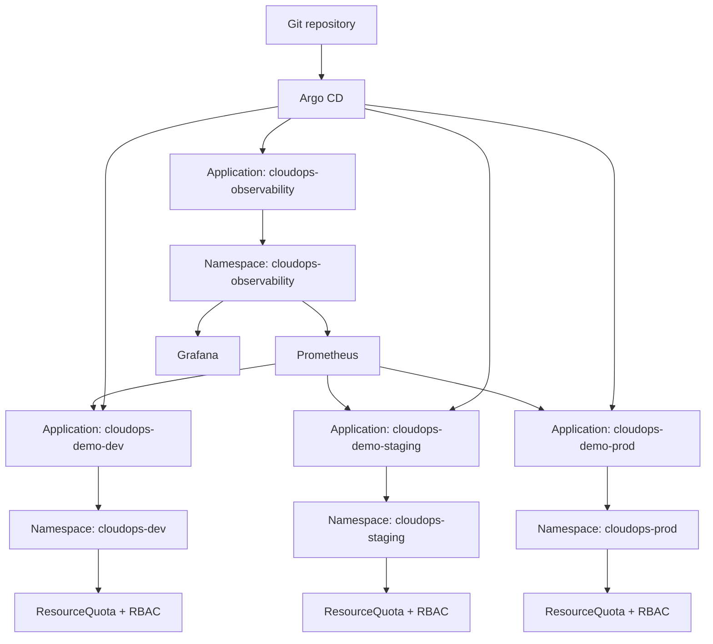

# Architecture

CloudOps GitOps Platform is built around one principle: Git is the source of truth for Kubernetes delivery.

The local implementation uses one Kubernetes cluster with three namespaces:

- `cloudops-dev`
- `cloudops-staging`
- `cloudops-prod`
- `cloudops-observability`

Each application namespace has its own ResourceQuota, scoped RoleBinding, ServiceAccount, and Argo CD Application. The observability namespace has its own ResourceQuota and scoped reader RBAC, while the Prometheus stack uses the cluster-level permissions required by `kube-prometheus-stack`. This is namespace isolation, not account-level or cluster-level isolation.

The Argo CD Applications use multiple sources: one source points at the Helm chart, and a second source exposes root-level environment values through the `$values/...` reference. This avoids relying on `../../` path traversal from inside the chart directory.

## Control Flow

1. A container image tag is built by CI.
2. The tag is written to `environments/dev/values.yaml`.
3. Argo CD syncs the `dev` Application.
4. The same image tag is promoted to `staging` through a pull request.
5. After validation, the tag is promoted to `prod` through another pull request.
6. Prometheus scrapes the app ServiceMonitors and cluster metrics.
7. Grafana reads from Prometheus for the GitOps workload dashboard.

## Runtime Flow

## v1.1 Observability Model

Observability is managed as a platform capability through Argo CD:

- `cloudops-observability` AppProject allows the Prometheus community Helm chart and this Git repository.
- `cloudops-observability` Application deploys `kube-prometheus-stack`, Grafana, and the project dashboard.
- The demo app exposes `/metrics`.
- The app Helm chart can create ServiceMonitors when the Prometheus Operator CRDs are present.

The observability AppProject allows cluster-scoped resources because `kube-prometheus-stack` installs CRDs, ClusterRoles, ClusterRoleBindings, and admission webhooks. That wider permission set is isolated in its own AppProject instead of being added to the app delivery AppProject.

## Cost Guardrail Model

Terraform owns the AWS cost guardrail:

- The `dev` root creates an AWS Budget by default.
- `staging` and `prod` expose the same budget variables but keep the budget disabled by default.
- Budget alert email is optional and should be passed through a local variable file or environment-specific Terraform input, not committed to Git.

## Why Argo CD

Argo CD provides a visible reconciliation loop, application health model, drift detection, self-healing, and Git revision history. Those are the behaviors this project wants to demonstrate.

Flux would also be a valid GitOps controller. Argo CD is used here because its API and UI make reconciliation, health, sync status, and rollback state straightforward to inspect during operations.

## Isolation Model

This project uses namespace isolation:

- Separate namespaces per environment
- Separate ResourceQuotas per namespace
- Separate RoleBindings per namespace
- Separate Argo CD Applications per environment
- Separate Helm values per environment

## Argo CD Sync Permissions

For the local build, Argo CD syncs through the permissions granted to the Argo CD controller. The `cloudops-*-deployer` ServiceAccounts and RoleBindings represent scoped environment access boundaries for manual/operator or CI-style interactions with each namespace.

Those ServiceAccounts are not Argo CD's active sync identity unless per-environment sync impersonation is separately configured and verified.

This does not provide the same blast-radius reduction as separate AWS accounts or separate EKS clusters.
