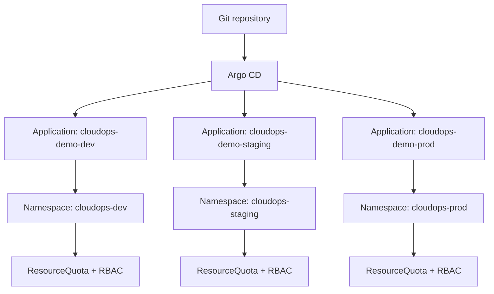

# Architecture

CloudOps GitOps Platform is built around one principle: Git is the source of truth for Kubernetes delivery.

The local implementation uses one Kubernetes cluster with three namespaces:

- `cloudops-dev`
- `cloudops-staging`
- `cloudops-prod`

Each namespace has its own ResourceQuota, scoped RoleBinding, ServiceAccount, and Argo CD Application. This is namespace isolation, not account-level or cluster-level isolation.

The Argo CD Applications use multiple sources: one source points at the Helm chart, and a second source exposes root-level environment values through the `$values/...` reference. This avoids relying on `../../` path traversal from inside the chart directory.

## Control Flow

1. A container image tag is built by CI.
2. The tag is written to `environments/dev/values.yaml`.
3. Argo CD syncs the `dev` Application.
4. The same image tag is promoted to `staging` through a pull request.
5. After validation, the tag is promoted to `prod` through another pull request.

## Runtime Flow

## Why Argo CD

Argo CD provides a visible reconciliation loop, application health model, drift detection, self-healing, and Git revision history. Those are the behaviors this project wants to demonstrate.

Flux would also be a valid GitOps controller. Argo CD is used here because its API and UI make reconciliation, health, sync status, and rollback state straightforward to inspect during operations.

## Isolation Model

This project uses namespace isolation:

- Separate namespaces per environment
- Separate ResourceQuotas per namespace
- Separate RoleBindings per namespace
- Separate Argo CD Applications per environment
- Separate Helm values per environment

## Argo CD Sync Permissions

For the local build, Argo CD syncs through the permissions granted to the Argo CD controller. The `cloudops-*-deployer` ServiceAccounts and RoleBindings represent scoped environment access boundaries for manual/operator or CI-style interactions with each namespace.

Those ServiceAccounts are not Argo CD's active sync identity unless per-environment sync impersonation is separately configured and verified.

This does not provide the same blast-radius reduction as separate AWS accounts or separate EKS clusters.
