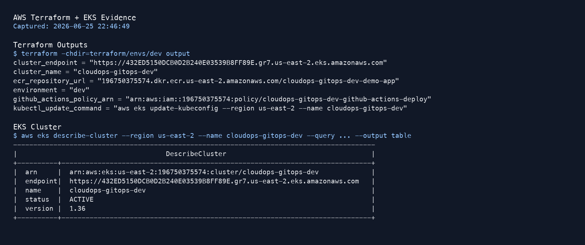
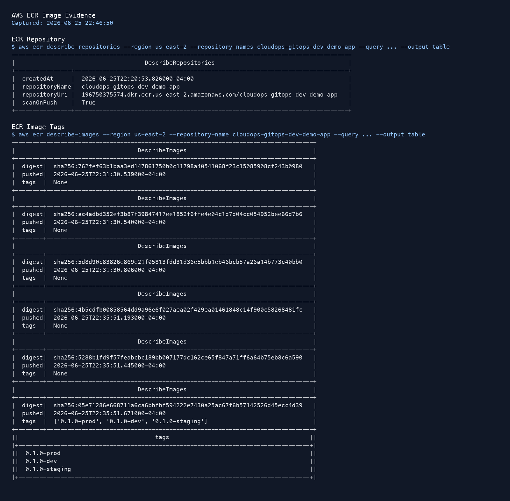
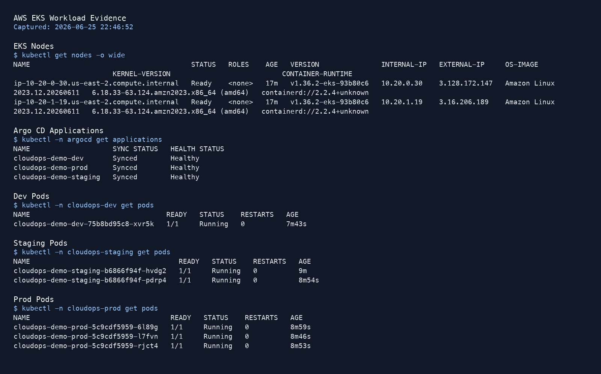
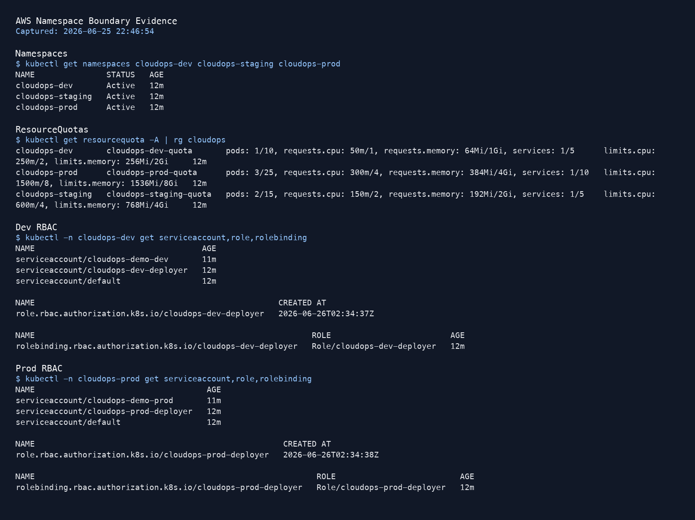
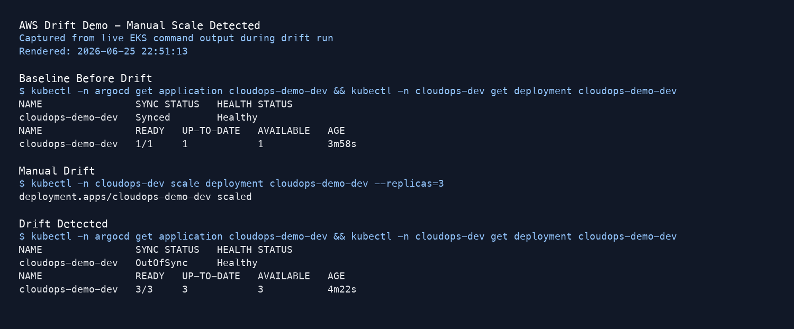
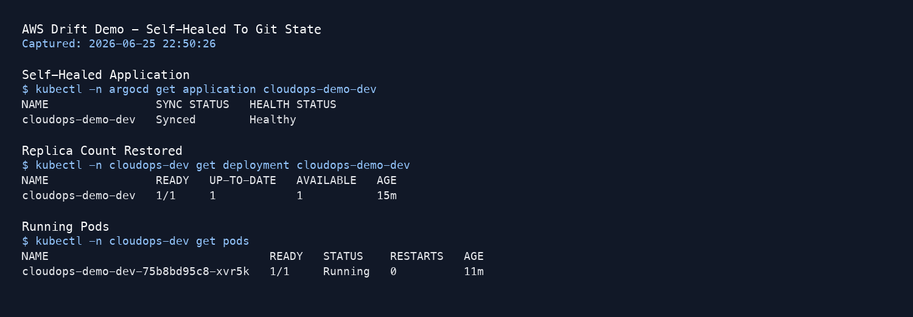
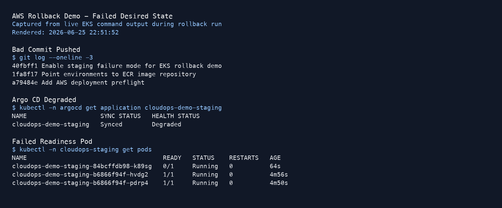
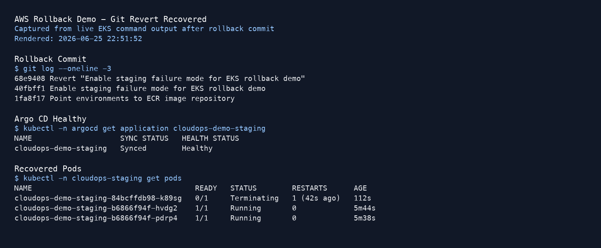
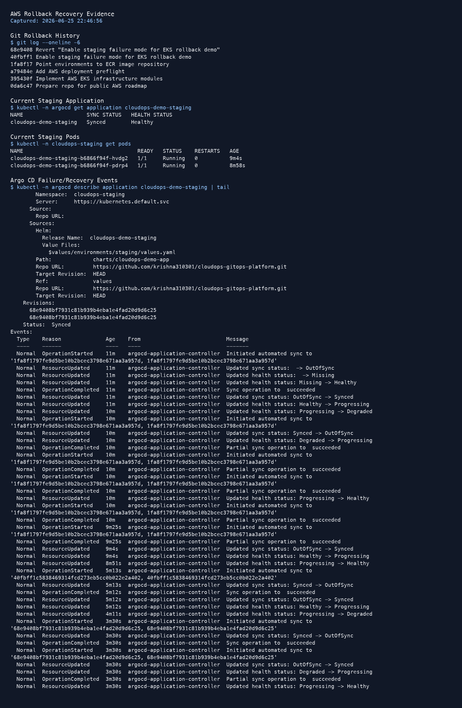

# AWS Validation Results

AWS validation ran after the local GitOps loop worked. The run used one EKS cluster, ECR images, Argo CD, and the public GitHub repository.

Validation date: June 25, 2026 local time / June 26, 2026 UTC.

## Runtime

- AWS account: `196750375574`
- Region: `us-east-2`
- EKS cluster: `cloudops-gitops-dev`
- Kubernetes version: `1.36`
- Node group: `cloudops-gitops-dev-nodes`
- Worker nodes: 2 Amazon Linux 2023 managed nodes
- ECR repository: `196750375574.dkr.ecr.us-east-2.amazonaws.com/cloudops-gitops-dev-demo-app`
- Git source: `https://github.com/krishna310301/cloudops-gitops-platform.git`
- Argo CD: `v3.4.4`

## Verified Outcomes

### Terraform AWS Foundation

Terraform applied the `terraform/envs/dev` root and created 19 AWS resources for the validation environment:

- VPC, public subnets, internet gateway, route table, and route associations
- ECR repository with lifecycle policy
- EKS control plane and managed node group
- EKS cluster role, node role, managed policy attachments, and deployment policy
- EKS control-plane security group

Output:



### ECR Image Publishing

The demo app image was rebuilt for `linux/amd64` and pushed to ECR with environment tags:

- `0.1.0-dev`
- `0.1.0-staging`
- `0.1.0-prod`

Output:



### EKS GitOps Sync

Argo CD ran on EKS and synced the public GitHub repository. The three Applications reached `Synced` and `Healthy`:

- `cloudops-demo-dev`
- `cloudops-demo-staging`
- `cloudops-demo-prod`

Output:




### Namespace Boundaries On EKS

The EKS cluster used separate namespace-scoped boundaries for `dev`, `staging`, and `prod`:

- Namespaces
- ResourceQuotas
- Roles and RoleBindings
- ServiceAccounts

Output:



### Drift Detection And Self-Healing On EKS

Manual drift was introduced by scaling `cloudops-demo-dev` from 1 replica to 3 replicas.

Argo CD detected the live-state mismatch as `OutOfSync` and restored the deployment to the Git-defined replica count.

Output:





### Failed Deployment And Git Rollback On EKS

A bad staging commit enabled `failureMode=true`. Readiness checks failed, and Argo CD marked staging as `Degraded`.

A Git revert restored the previous desired state. Argo CD synced the reverted revision and brought staging back to `Synced` and `Healthy`.

Output:







## Important Implementation Note

The first ECR push from a local Apple Silicon machine produced an ARM image manifest. EKS nodes were AMD64, so pods failed with:

```text
no match for platform in manifest
```

The fix was to rebuild and push the image with:

```bash
docker buildx build --platform linux/amd64 \
  -t "$ECR_REPO:0.1.0-dev" \
  -t "$ECR_REPO:0.1.0-staging" \
  -t "$ECR_REPO:0.1.0-prod" \
  --push ./app
```

That is documented in the AWS deployment runbook because it is a realistic local-to-EKS issue.

## Current Boundary

Implemented:

> Provisioned an AWS EKS/ECR/VPC/IAM foundation with Terraform and deployed a GitOps workflow to EKS using Argo CD, Helm, and GitHub as the source of truth.

Implemented:

> Implemented namespace-isolated `dev`, `staging`, and `prod` delivery environments inside one EKS cluster.

Not implemented:

> Three separate EKS clusters, separate AWS accounts, or Argo CD syncing through least-privilege per-environment ServiceAccounts.
