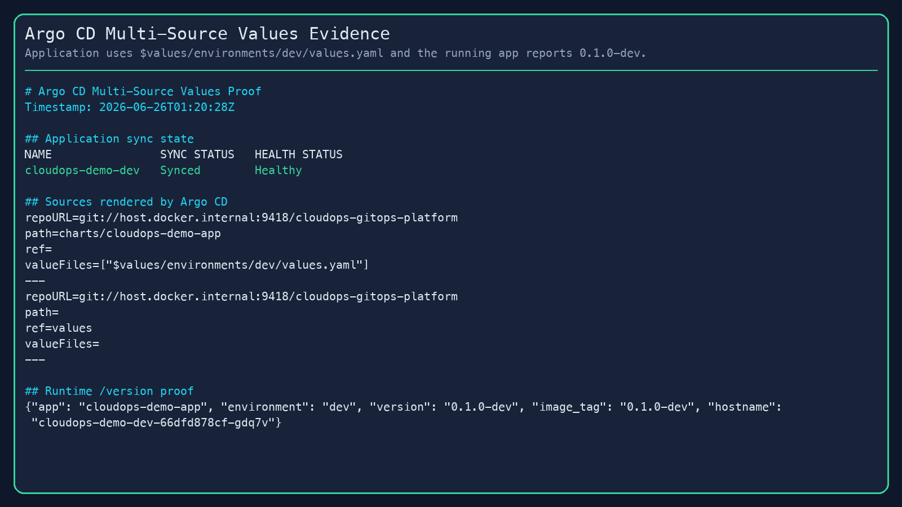
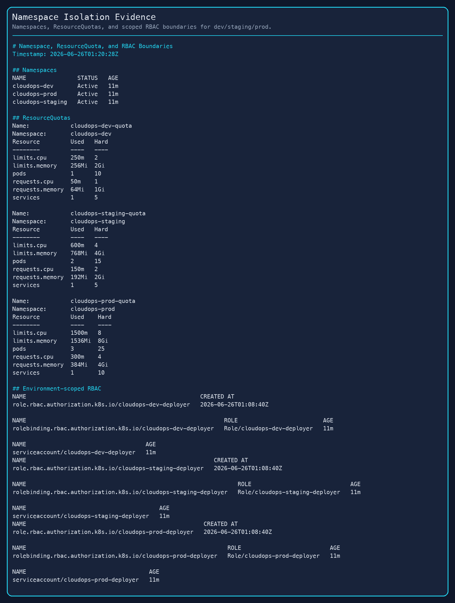
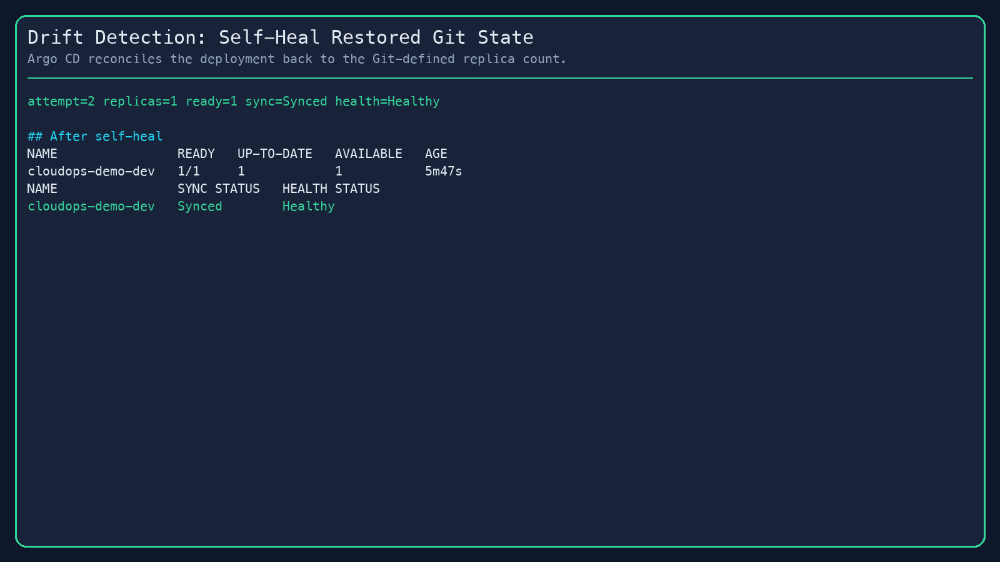
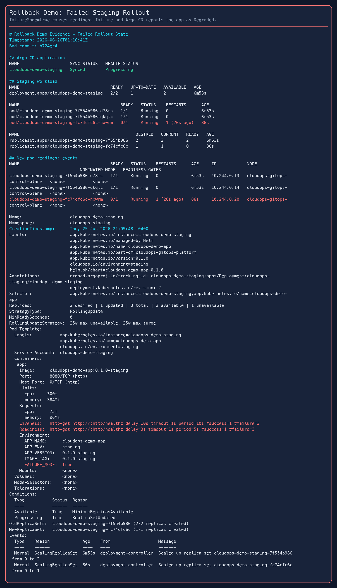

# Local Validation Results

This document records the completed local validation for CloudOps GitOps Platform.

Validation date: June 25, 2026 local time / June 26, 2026 UTC.

## Runtime

- Local cluster: `kind-cloudops-gitops`
- Argo CD: `v3.4.4`
- Git source: `git://host.docker.internal:9418/cloudops-gitops-platform`
- Demo app image: local `cloudops-demo-app` image loaded into kind
- Current local re-run values root: `environments/local`

## Verified Outcomes

### Three Applications Synced And Healthy

Argo CD successfully synced three Applications:

- `cloudops-demo-dev`
- `cloudops-demo-staging`
- `cloudops-demo-prod`

Evidence:


### Multi-Source Values Resolution

The `dev` Application uses Argo CD multi-source configuration:

- chart source: `charts/cloudops-demo-app`
- values source ref: `values`
- values file at validation time: `$values/environments/dev/values.yaml`
- current local re-run value file: `$values/environments/local/dev/values.yaml`

The running app returned `environment=dev` and `image_tag=0.1.0-dev`, proving the environment values file was applied.

Evidence:



### Namespace Boundaries

The local cluster has separate namespaces, ResourceQuotas, Roles, RoleBindings, and ServiceAccounts for `dev`, `staging`, and `prod`.

Evidence:



### Drift Detection And Self-Healing

Manual drift was introduced by scaling `cloudops-demo-dev` from 1 replica to 3 replicas.

Argo CD detected the drift as `OutOfSync` and restored the deployment to the Git-defined replica count.

Evidence:




### Failed Deployment And Git Rollback

A bad staging configuration enabled `failureMode=true`, causing the readiness probe to fail. Argo CD marked staging as `Degraded`.

Evidence:




Recovery happened through a Git revert commit, after which Argo CD restored staging to `Synced` and `Healthy`.

Evidence:


## Commands Used For Final Checks

```bash
python3 -m unittest discover -s app/tests -v
helm lint charts/cloudops-demo-app -f environments/dev/values.yaml
helm lint charts/cloudops-demo-app -f environments/staging/values.yaml
helm lint charts/cloudops-demo-app -f environments/prod/values.yaml
./scripts/render-helm.sh
VALUES_ROOT=environments/local ./scripts/render-helm.sh
bash -n scripts/*.sh
terraform -chdir=terraform fmt -check -recursive
```
